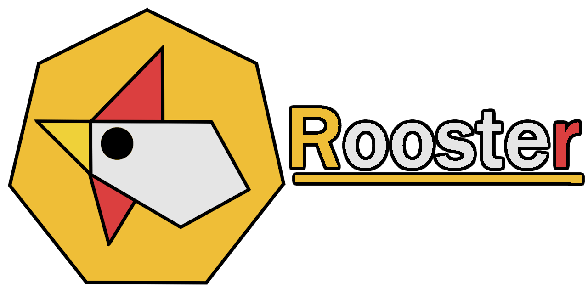

# Yet in Development

Documentation not complete (not even close)

# Introduction

Rooster is a Paper Framework designed to be used with Kotlin. <br>
It provides multiple features which make it easier to develop your plugin with
less of the boilerplate code, so you can actually focus on your logic.

### Features

- [ArgumentAPI](./Arguments.md), a hew way of registering Commands
- [InterfaceAPI](Interface.md), a new way of registering Interfaces
- [Rooster Annotations](RoosterAnnotations.md), Register Core pieces using Annotations
- [Database Support](Database.md), Database Integration using SQLite and SQL Exposed
- [Localization](Localization.md)
- More
    - [Region Helper Class](Regions.md)
    - [Particle Support](Particles.md)
    - [Process helper](Process.md)
    - [Util functions](UtilFunctions.md)

# How to start

To use Rooster, you need to download it as a dependency. <br>
[Import Stuff here] <br>

Once you are have Rooster installed, put this into your onEnable for your Main file:

```kotlin
class YourPlugin : JavaPlugin() {
    fun onEnable() {
        Rooster.initialize(this)
        // 'this' functions here as the Plugin instance
    }
}
```

---

# [Roadmap](RoadMap.md)